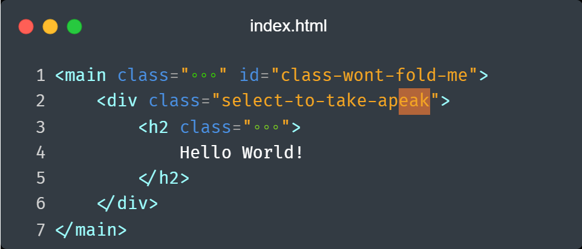

    

## STILL WIP

This extension miminc the folding experiance but for inline code folding.
It also expand/unfold the code when clicking or selecting the code block. 
Useful when you work on utility classes in a framework like tailwind css, this would allow to see the code in cleaner view. It can be configured to select what part of the line code that should be folded.

### Available settings:
- `inlineFold.regex` regex to match the code line
- `inlineFold.regexFlags` regex flags
- `inlineFold.regexGroup` regex group that match the code that should be folded
- `inlineFold.unfoldedOpacity` opacity of the unfolded code when is clicked by mouse or being selected
- `inlineFold.maskChar` text/character to mask the code when it is folded
- `inlineFold.maskColor` color of the mask character
- `inlineFold.after` an optional text/character to append to the end of folded code

### Use settings UI to configure the extension.
No registered commands yet, would love to hear some suggesions :)

## Example of default settings:

    

